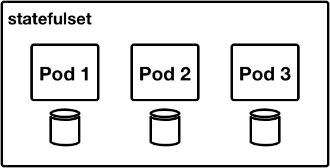
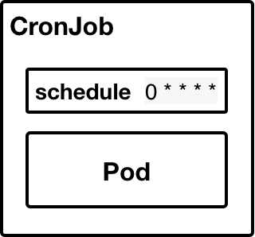

# 1. Kubenetes là gì?
    - Kubernetes là một platform để deploy, scaling và manage (quản lý) các ứng dụng hoạt động dựa trên Container. Các ứng dụng có thể khác nhau về kích thước: từ 1 cho đến hàng nghìn server. Với Kubernetes chúng ta có thể phát triển application một cách linh hoạt và đáng tin cậy.	
# 2. Components của K8s:
    - Khi triển khai 1 k8s, ta sẽ có 1 Cluster:
    - 1 Cluster gồm nhiều Worker Nodes để chạy các ứng dụng trong container, các Nodes sẽ cung cấp  các tài nguyên như computing, memory, storage và networking 
    - 1 hệ thống lớn có thể gồm nhiều Cluster
   

   - Có 2 loại Nodes: Master (Control Plane) và Worker
## 2.1. Master (Control Plane):
    - Đối với cluster nhỏ , Master có thể chạy trên một Node, nhưng trong một cluster lớn, để đảm bảo tính High-Availability thì Master có thể được chạy trên nhiều Node. HA nghĩa là khi mà một Node trong cluster dừng hoạt động (máy vật lí hoặc máy ảo bị hỏng) thì hệ thống sẽ có 1 Node khác thay thế, và vẫn duy trì như không có gì xảy ra. Master sẽ bao gồm 5 thành phần chính sau:
### 2.1.1. Api-server:
    - Nhiệm vụ: Cung cấp REST API cho Kubenetes Cluster dùng để tạo configuration data (cấu trúc data) cho các objects như Pod, Services.
### 2.1.2. Etcd: (Kho lưu trữ data):

    - Là cơ sở dữ liệu Key-value Storage có tính HA cao, được sử dụng để lưu trữ toàn bộ cấu hình, trạng thái và metadata của Kubernetes Cluster. 
    - Trong các cluster nhỏ, etcd có thể chạy trên cùng một Node với các thành phần khác. Nhưng trong các cluster lớn, etcd có thể chạy dự phòng trên nhiều Node để đảm bảo tính khả dụng của toàn hệ thống.
    - Đảm bảo tính HA cao: Dữ liệu mới được ghi vào kho lưu trữ chỉ bằng cách thêm vào cuối nó bởi vậy nên dữ liệu sẽ không bao giờ bị thay đổi trong đây. Dữ liệu lỗi thời được nén định kỳ để giảm thiểu dung lượng của kho dữ liệu.
    - Chỉ có API-server có thể giao tiếp với etcd.
    - Công cụ quản lý dưới dạng CLI (command line interface) của etcd - etcdctl cung cấp khả năng backup, snapshot, và restore (đặc biệt hữu dụng đối vs single etcd) – thường thấy trong môi trường Dev. Tuy nhiên, trong môi trường Staging và Production, điều cực kỳ quan trọng là phải sao chép các kho dữ liệu ở chế độ HA, để có khả năng phục hồi dữ liệu cấu hình cụm.

    - Công cụ để khởi động cụm Kubenetes: kubeadm, mặc định cung cấp nút master với etcd dạng stacked etcd

   
   
    - Hoặc cách ly nơi lưu trữ dữ liệu khỏi master, ta dùng cấu trúc external etcd

   

    - etcd được viết bằng Go, dựa trên thuật toán Raft Consensus điều này cho phép một tập hợp các máy hoạt động như một Cluster thống nhất có thể tồn tại sau những sự cố của một số Nodes của nó. Tại bất kỳ thời điểm nào, một trong các Node trong Cluster sẽ là nút chính (master) và phần còn lại sẽ là nút theo dõi (follower). Bất kỳ nút nào cũng có thể được coi là nút chính (master). 
    - Trong trường hợp 1 Node ngừng hoạt động, các Pods trên cùng 1 Node đó sẽ được schedule lại trên 1 Node khác trong cùng 1 Cluster.
   

### 2.1.3. Kube Controller Manager:
    - Chạy các controllers chịu trách nhiệm phản ứng khi các Nodes không khả dụng, để đảm bảo số pod như mong đợi, để tạo endpoints, service accounts, và API access tokens.
### 2.1.4. Cloud Controller Manager:
    - Là một tập hợp các logic dành riêng cho Cloud Provider (GCP, AWS, Azure) cho phép bạn liên kết Kubernetes Cluster với API của Cloud Provider. Nếu bạn đang chạy Kubernetes on-premises hoặc môi trường dev trên máy tính của bạn, thì mặc định Cluster sẽ không có Cloud Controller Manager.
### 2.1.5. Scheduler:
    - Scheduler sử dụng Kubernetes API để tìm các Pod chưa được lên lịch. Sau đó, scheduler sẽ đặt các Pod này vào các Node dựa trên tài nguyên và các ràng buộc khác được định nghĩa trong manifest file của Pod. Scheduler sẽ cố gắng đảm bảo rằng các Pod của cùng một application sẽ được phân phối trên các Node khác nhau để đảm bảo tính khả dụng.

    - Bộ lập lịch có khả năng cấu hình và tùy chỉnh cực kì cao dựa trên các scheduling policies, plugins, and profiles. Tiếp đó, các bộ lập lịch tùy chỉnh bổ sung có thể cũng được hỗ trợ, do đó các dữ liệu cấu hình (objects' configuration data) nên bao gồm tên của bộ lập lịch tùy chỉnh mong muốn để có những quyết định lập lịch phù hợp với cài đặt của chúng. Nếu không có bất kỳ dữ liệu nào được cung cấp, bộ lập lịch mặc định sẽ được sử dụng.

    - Một bộ lập lịch thường cực kì quan trọng và phức tạp trong một cụm Kubernetes có nhiều nút. Tuy nhiên trong các cụm chỉ có duy nhất một nút, chẳng hạn như cụm được sử dụng làm ví dụ trong khóa học này, công việc của bộ lập lịch về cơ bản khá đơn giản.
## 2.2. Worker:
### 2.2.1. kube-proxy:
    - kube-proxy là tác nhân mạng chạy trên mỗi nút chịu trách nhiệm cập nhật và bảo trì động của các luật điều phối mạng trên nút đó. Nó trừu tượng hóa chi tiết của quá trình hoạt động mạng của Pod và chuyển tiếp các kết nối đến Pods.
    - kube-proxy chịu trách nhiệm cho việc chuyển tiếp dòng TCP, UDP và SCTP hoặc xoay vòng chuyển tiếp qua một tập các Pod backends và nó cũng cài đặt các luật chuyển tiếp được định nghĩa bởi người dùng thông qua các đối tượng Server API.
### 2.2.2. kubelet
    - kubelet là tác tử chạy trên mỗi nút và giao tiếp với các thành phần của control plane từ nút master. Nó nhận thông tin định nghĩa Pod, chủ yếu từ API Server và tương tác với container runtime ở trên nút để chạy các container liên quan đến Pod đó. Nó cũng theo dõi tình trạng và tài nguyên của các Pod đang chạy các containers.
    - kubelet kết nối với các container runtime thông qua interface dựa trên plugin - Container Runtime Interface (CRI). CRI bao gồm bộ đệm protocol, gRPC API, thư viện cũng như các thông số kỹ thuật và công cụ bổ sung hiện đang được phát triển. Để kết nối với container runtime có thể hoán đổi cho nhau, kubelet sử dụng ứng dụng shim để cung cấp một lớp trừu tượng rõ ràng giữa kubelet và container runtime.

# 3. Cac Workload trong Kubernetes:
## 3.1. Pod:
    - Pod là một đơn vị thực thi cơ bản và nhỏ nhất trong Kubernetes. Pod có thể có một hoặc nhiều container.

| Loại container | Mô tả|
|---|---|
| Application | Đây là core container của một ứng dụng, một Pod phải có loại container này, các mô hình Pod phổ biến thường chỉ có application container.|
| Sidecar | Pod có thể có container loại Sidecar làm một số công việc hữu ích để hỗ trợ cho application container. Container loại này thường đảm trách các vai trò như thu thập log hay làm reverse proxy. Một Pod có thể có rất nhiều Sidecar container.|
| Init | Đôi khi cần phải thực hiện một số khởi tạo trước khi khởi chạy application container, ví dụ như khởi tạo database ban đầu. Một Pod có thể có rất nhiều Init container, chúng được chạy từng cái một theo thứ tự.|

## 3.2. Deployment and ReplicasSet:
    - Deployment trong Kubernetes cho phép quản lý vòng đời của các Pod và một Resource liên quan gọi là ReplicaSet. Deployment chứa đặc tả (specification) cho một Pod và các thông tin thêm, như số lượng Pod để chạy. Nếu cần chạy một ứng dụng stateless mà nó sẽ chạy liên tục, ví dụ như HTTP Server, thì chắc chắn cần Deployment. Deployment trong Kubernetes cho phép cập nhật một ứng dụng đang chạy mà không có downtime. Deployment cũng chỉ định một chiến lược (strategy) để khởi động lại Pod khi chúng die hoặc crash.
   
    - ReplicaSet được tạo khi Deployment được tạo hoặc được chỉnh sửa và thật sự là ReplicaSet được dùng như định nghĩa để tạo Pod. Sơ đồ sau mô tả mối quan hệ giữa Deployment, ReplicaSet và Pod trong Kubernetes:
   
## 3.3. StatefulSet:
    - Trong Kubernetes, một StatefulSet quản lý tập hợp các Pod về triển khai (deployment) và mở rộng (scaling), StatefulSet cung cấp đảm bảo về thứ tự (ordering) và sự duy nhất (uniqueness) của các Pod mà nó quản lý. Về thứ tự, nó đảm bảo thứ tự các Pod tạo ra và xóa đi. Về sự duy nhất, nó đảm bảo duy nhất về tên của Pod và storage volume riêng kèm theo Pod.
   
## 3.4. DaemonSet:
    - Một DaemonSet trong Kubernetes đảm bảo một Pod chạy trên tất cả hoặc tập hợp nhỏ các Kubernetes Node đã sẵn sàng. Ngay khi Node mới được thêm vào Kubernetes Cluster, thì Pod sẽ được thêm ngay vào. Ngay khi Node được xóa khỏi Kubernetes Cluster, thì Pod liên quan cũng được garbage collector thu gom. Xóa một DaemonSet sẽ đồng nghĩa với việc xóa tất cả các Pod mà nó đã tạo ra.
   

    - Khi nào cần sử dụng DaemonSet trong Kubernetes:
        - Chạy cluster storage daemon như glusterd hoặc ceph trên mỗi node.
        - Chạy log collector daemon trên mỗi node như fluentd hoặc logstash.
        - Chạy monitoring daemon trên mỗi node như Prometheus Node Exporter hoặc Datadog agent.
## 3.5. Jobs:
    - Trong Kubernetes, Job tạo nên một hoặc nhiều Pod đảm bảo rằng ít nhất một lượng nhất định trong số chúng chạy đến khi hoàn thành. Không giống với ReplicaSet, ngay khi tiến trình trong container hoàn tất thành công, container sẽ không được khởi động lại. Sử dụng Job trong Kubernetes khi muốn chạy tiến trình một lần.
   
## 3.6. CronJob (Replication Controller):
    - Trong Kubernetes, CronJob chỉ đơn giản là chạy Job theo lịch định sẵn, định dạng lịch định sẵn theo định dạng của Cron trên Linux.
   
# 4. References:
    - https://kubernetes.io/docs/concepts/workloads
